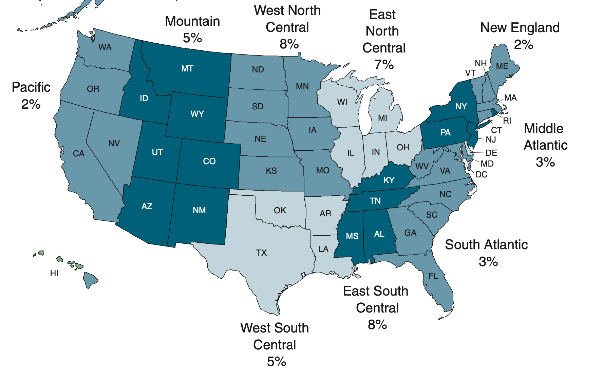
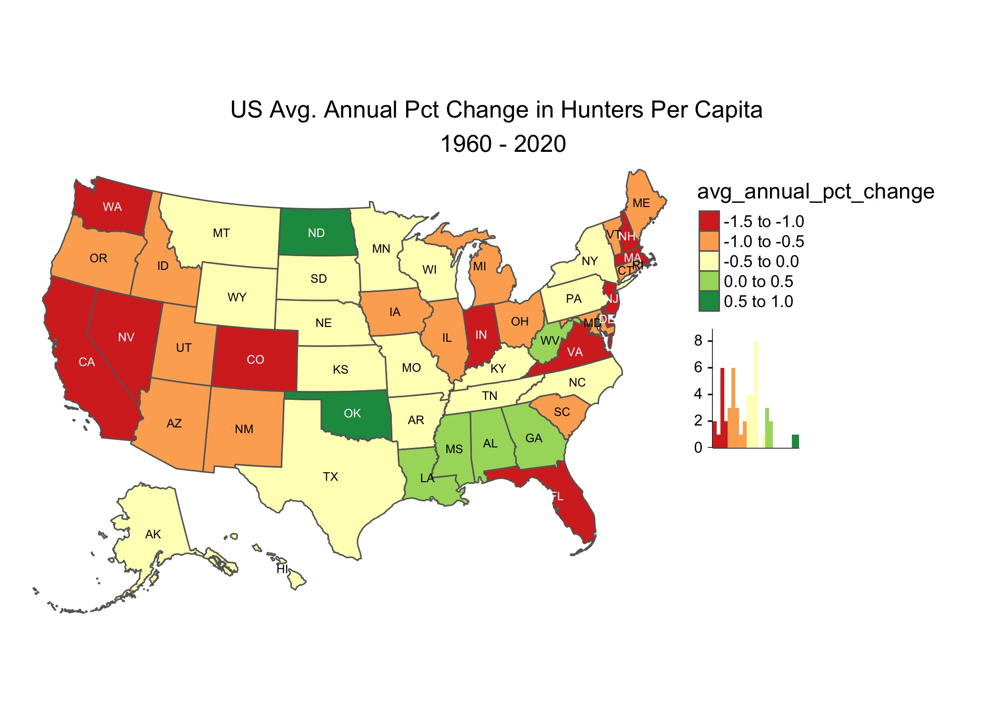
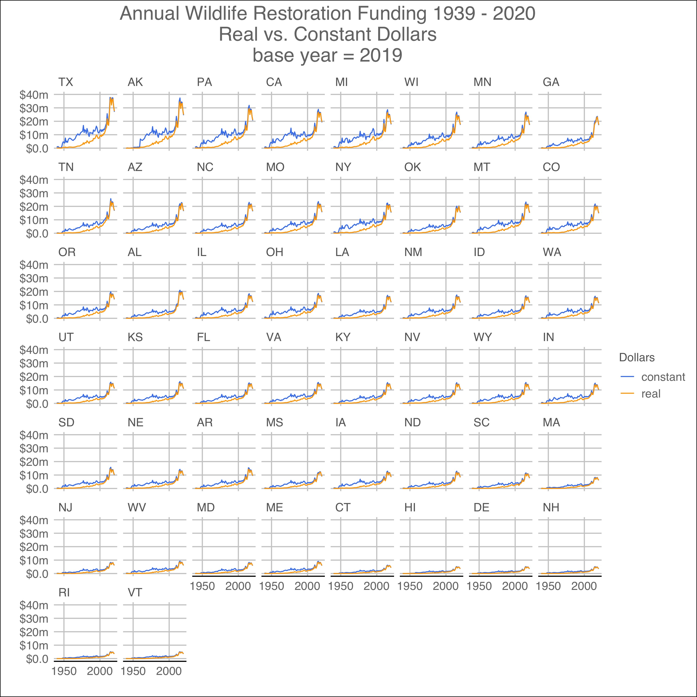

```{r setup, include=FALSE}
knitr::opts_chunk$set(echo = TRUE)
# https://learnui.design/tools/data-color-picker.html#palette
my.palettes <- list(qualitative = c("#4582ec", "#c86edb", "#ff5ca4", "#ff745c", "#ffa600"),
                     sequential = c("#4582ec", "#7499f1", "#98b0f6", "#b9c8fb", "#d9e1ff"),
                     diverging = c("#4582ec",  "#8da5ef", "#c2caf0", "#f1f1f1", "#f0b8b8",
                                   "#e67f83", "#d43d51")
                     )
```

```{r load_file, include=FALSE}
source("./R/00_main.R")
file <- "./data_tidy/hunting_licenses_by_state_1960_and_2020.csv"
df.00 <- data.table::fread(file = file, data.table = F, colClasses = "character")
df.00$year <- as.integer(df.00$year)
df.00$value <- as.numeric(df.00$value)
```

```{r load_libraries, include = FALSE}
# x <- c("ggmap", "rgdal", "rgeos", "maptools", "dplyr", "tidyr", "tmap")
# #install.packages(x)
# lapply(x, library, character.only = TRUE)
library("ggplot2")
library("dplyr")
library("magrittr")
library("ggthemes")
library("flextable")
library("officer")
library("knitr")
library("kableExtra")
library(sparkline)
```

# Question

Hunting as a pastime is declining in the United States. Its prolonged slump and projected decline is significant because license fees and taxes fund wildlife conservation efforts.   This "user-play, user-pay" funding system--a model replicated across the globe--is jeopardizing conservation efforts as hunting declines.  [@rottDeclineHuntersThreatens] Recent legislative proposal at the federal level have attempted to diversify funding sources in response.  The question for consideration is whether hunting  declined from 1960 to 2020, how much agreement exists between available data sources, and which states have been impacted.

# Background

## Wildlife as Public Resource

The Public Trust Doctrine (PTD) is considered to be the cornerstone of the North American Model of Wildlife Conservation (AMWC). The doctrine posits that "wildlife is owned by no one and held in trust by governments for the present and future benefit of its citizens."[@jacobsonConservationInstitution21st2010]  It was first recognized by the United States Supreme Court in the seminal case Martin vs. Waddell's Lessee, 41 U.S. 367 (1842). There, the Court held "that the *public held a common right* to fish in navigable and tidal waters of New Jersey because they and their underlying lands *were owned by the state for the common use by the people*." [@thewildlifesocietyPublicTrustDoctrine2010]  Since the government is entrusted with the public's assets, it has a responsiblity as trustee and fiduciary to safeguard them for the long term benefit of the public.[@thewildlifesocietyPublicTrustDoctrine2010]


## U.S. Conservation Movement

The U.S. Conservation movement dates back to the establishment of the first national park.  In 1872, a bill creating Yellowstone National Park was signed into law by President Ulysses S. Grant. American sportsmen were the catalyst for the U.S. conservation movement who saw the waste of wildlife and habitat as a cause for the extinction of some species and sought to preserve others.[@reigerAmericanSportsmenOrigins2000].  Extinction of the passenger pigeon and extirpation of the bison.

The early 1900s and future president of the United States Teddy Rosevelt was a prominent spokesperson and advocate.[@reigerAmericanSportsmenOrigins2000]

The Organic Act of 1916 created the National Park Service and charged them to "promote and regulate . . . the national parks, monuments and reservations" consistent with their purpose "to conserve the scenery and the natural and historic objects and wildlife therein, and to provide for the enjoyment of the same in such manner and by such means as will leave them unimpaired for the enjoyment of future generations."

Finally in 1937, the Pittman–Robertson Federal Aid in Wildlife Restoration Act became law, providing funding for state agencies to carry out  conservation efforts. The Pittman–Robertson Act took over a preëxisting 11% excise tax on firearms and ammunition. Instead of going into the U.S. Treasury as it had done in the past, the money generated by the tax is instead given to the Secretary of the Interior to distribute to the states.The Secretary determines how much to give to each state based on a formula that takes into account both the area of the state and its number of licensed hunters.  The Act is widely credited for restoring the populations of white-tailed deer, wild turkeys and wood decks. Other animals like American black bears, elk, and cougars have expanded their ranges.

Due to the success of the Pittman–Robertson Act, a similar act was proposed for the protection of fish species, titled his act was titled the Federal Aid in Sports Fish Restoration Act. 


## Decline of Hunting

According to an article in Outdoor Life, hunting reached its peak in 1982 when nearly 17 million hunters purchased 28.3 million licenses. Additionally, persons born between the years 1946 and 1964, commonly referred to as the "Baby Boomers", are the largest cohort of hunters and will age out of the sport in the next 15 years.[@krebsWhyWeSuck2019]  The decline was acknowledged and projected to continue in Wisconsin deer hunters through 2030. [@winklerFutureHuntingAgeperiodcohort2013]

In a 2012 study of Wisconsin deer hunters, researchers projected 10% decline through 2020 and an additional 18% decline from 2020 to 2030. [@winklerFutureHuntingAgeperiodcohort2013]

## State Role in Conservation

Wildlife management is divided between the federal government and individual states. States have primary responsibility as the trustees of wildlife due to the Public Trust Doctrine, except where the Constitution provided for federal oversight.[@beanEvolutionNationalWildlife1997]

"Regulated hunting and trapping have been cornerstones of wildlife management in the United States since the advent of wildlife conservation," write two prominent zoologists along these lines."[@bravermanConservationHuntingTill2015]  

## Reasons for Decline

Proferred reasons for the decline include aging of hunting population, increased urbanization, change in consumer preferences . . .

## Declining Fees and Taxes

"Fish and wildlife conservation funding in the U.S., at least at the state level, typically is characterized as a user-pay, user-benefit model." [@organWildlifeSocietyTechnical2012] "From the earliest days of active management and enforcement by nascent state fish and wildlife agencies, hunters, anglers, and trappers have
funded restoration and conservation initiatives."[@organWildlifeSocietyTechnical2012] Conservation efforts are generally financed through two sources: the sale of hunting licenses from the state and the sale of firearms.  Though smaller resources also add to conservation efforts.  To this day, the combination of sportsmen-derived funds from hunting licenses and gun sales comprise between 60 and 90 percent of the typical state fish and wildlife agency budget.[@organWildlifeSocietyTechnical2012] Some wildlife agencies budgets, however rely on even higher percentages of revenue from sportsment with states like Texas, for example, funding 97% of its conservation efforts from these two sources.[@bravermanConservationHuntingTill2015]

"Hunters are key stakeholders; their contributions
and integral role in wildlife conservation continue to
be important. Maintaining hunter involvement and financial
support of the Institution is necessary, but not sufficient." [@jacobsonConservationInstitution21st2010] 

""We can no longer rely on our most committed constituency to carry the brunt of the financial burden and subsequently be the primary beneficiaries of our actions."[@jacobsonConservationInstitution21st2010]

Conservations efforts require long term, sustainable and dependable funding sources.  [@jacobsonConservationInstitution21st2010] User-based funding is declining and benefits a narrow group of constituents.  "Other funding options states have pursued include dedicated revenues from vehicle license plates, voluntary tax check-offs, and nonprofit foundations to accept financial gifts."[@jacobsonConservationInstitution21st2010]  These fees have been voluntary and negligible in their impact.  Missouri and Virginia were cited as having funding models that were "reliable, consistent and broad-based."  [@jacobsonConservationInstitution21st2010]

### Federal Taxes

-  a 10 percent tax on pistols and revolvers[@26USCS4181];
-  an 11 percent tax on bows, archery equipment,and long arms;
-  an inflation adjusted tax on arrow shafts, standing at 48 cents per shaft in 2014;

"Congress requires each state and U.S. territory to develop a State Wildlife Action Plan - a proactive, comprehensive conservation strategy which examines species health and recommends actions to conserve wildlife and vital habitat before they become more rare and costly to protect."[@allianceforamericasfishwildlifeUsAllianceAmerica: 2]

"A national survey determined that each state needs an average of 26 million in new funding annually ($1.3 billion collectively) to e!ectively implement State Wildlife Action Plans to prevent species from becoming threatened or endangered."[@allianceforamericasfishwildlifeUsAllianceAmerica: 3] 

"Current funding through State and Tribal Wildlife Grant Program funds only reaches a national total of 60 million on average, a shortfall of more than $1.2 billion annually."[@allianceforamericasfishwildlifeUsAllianceAmerica] 

## Recent Federal Developments

"The bipartisan Recovering America's Wildlife Act establishes a 21st century funding model for the proactive conservation of fish and wildlife. The bill will redirect 1.3 billion in existing revenues to state fish and wildlife agencies to implement their science-driven wildlife action plans, and an additional $97.5 million to tribal wildlife managers to conserve species on tribal."[@allianceforamericasfishwildlifeUsAllianceAmerica] 

States would be required to provide at least 25% in nonfederal matching funds. The source of match can be monetary or in-kind contributions originating from state or local governments or private entities such as conservation organizations, universities, businesses, private landowners, or volunteers." [@allianceforamericasfishwildlifeUsAllianceAmerica: 3]


Every five years the National Survey of Fishing, Hunting and Wildlife Associated Recreation is conducted.  The last survey in 2016 found that "11.5 million people 16 years and older enjoyed hunting a variety of animals within the United States. They hunted 184 million days and took 147 million trips. Hunting expenditures totaled $26.2 billion."  The survey reported that the national participation rate was four percent with significant regional variation. For example, the New England region had a two percent participation rate while the East South Central region had an eight percent participation rate.

<center>

{#id .class width=75% height=75%}

</center>

Various explanations for the decline in hunting have been tendered. Researchers found evidence that more people opt for electronic entertainment and urban living as explainations for the decline in hunting. [@robisonWhitherLoveHunting2012]

# Data Sources

Data was retrieved from three sources: the U.S. Fish and Wildlife Agency, the U.S. Census Bureau and the National Survey of Fishing, Hunting, & Wildlife-Associated Recreation.

## U.S. Fish and Wildlife

States require a hunting license for those harvesting game.  People who engage in hunting within the boundaries of the state they reside in require a "resident" hunting license whereas those who travel to another state require a "non-resident" license. A proxy for the popularity of the pastime is the number of hunting licenses issued by the states. The U.S. Fish and Wildlife tracks the issuance of hunting, and fishing, licenses.[@usfishwildlifeUSFishWildlife2020] Data is available via their [website](https://www.fws.gov/wsfrprograms/Subpages/LicenseInfo/Hunting.htm). Hunting license information is collected annually from (1) state, (2) territory and (3) insular areas license certifications. The data is available for the years 1963 - 2020, though it is in a pdf format.

## IPUMS Population Data

According to their [website](https://www.nhgis.org/about), "the IPUMS National Historical Geographic Information System (NHGIS) provides free online access to summary statistics and GIS files for U.S. censuses and other nationwide surveys from 1790 through the present." [@gorayIPUMSNHGIS2016].  The total population data by state was needed for the years studied so that a per capita computation could be made.[@mansonIPUMSNationalHistorical2020]
NHGIS is one of several IPUMS data integration projects located  with the Minnesota Population Center at the Institute for Social Research & Data Innovation at the University of Minnesota. [@gorayIPUMSNHGIS2016].

## National Survey FHWAR

The National Survey of Fishing, Hunting, & Wildlife-Associated Recreation (FHWAR)  reports result from interviews with U.S. residents about their fishing, hunting, and wildlife watching. The survey has been taken every five years since 1955 and potentially provides a rich and insightful look into hunting trends. Its duration exceeds that of the hunting license data that began in 1963.  [@u.s.departmentoftheinterior2016NationalSurvey2016] The agency describes its survey as "one of the oldest and most comprehensive continuing recreation surveys."[@u.s.departmentoftheinterior2016NationalSurvey2016]  The 2016 survey--the latest available, 3,931 anglers and hunters and 3,997 wildlife watchers were interviewed. [@u.s.departmentoftheinterior2016NationalSurvey2016] The report was explicit that the sample size was large enough for a national conclusion, but was silent on its insight at the state-level. "The 2016 Survey's questions and methodology were similar to those used in the 2011, 2006, 2001, 1996, and 1991 Surveys. Therefore, the estimates are comparable." [@u.s.departmentoftheinterior2016NationalSurvey2016]

# Analysis

## General

The analysis relied upon the statistical programming language known as `R`. [@rcoreteamProjectStatisticalComputing2020] The plots were graphed with `ggplot2`.[@wickhamGgplot2ElegantGraphics2016] The data from the sources above were combined into a single, wide dataframe and then converted into long format.  The total number of observations in the dataframe was `r nrow(df.00)` and the number of variables or columns was `r ncol(df.00)`. The column names "key" and "value" are the default labels in the `tidyr` package. [@wickhamTidyrTidyMessy2020] Consistent with good data practice, each row is an observation and each column is a variable.  [@wickhamTidyData2014] The top 5 rows of the dataframe are shown below for illustrative purposes.

```{r head-dataframe, echo=FALSE}
df.table <- head(df.00)
# knitr::kable(df.table, caption = "Top 5 Rows of Dataframe", format.args = list(big.mark = ","))
df.table$value <- prettyNum(df.table$value, big.mark=",", scientific=FALSE)

kbl(df.table, caption = "Top 5 Rows of Hunting License Dataframe") %>%
  kable_styling(bootstrap_options = "striped", full_width = T)
```

The variables that were assembled into the dataframe are as follows:

```{r variable-listing-table, echo=FALSE}
t1 <- table(df.00$key, df.00$year)
kbl(t1, caption = "Variable Frequency by Year") %>%
      kable_styling(bootstrap_options = "striped", full_width = T)

```

Not all variables were carried forward through the period of `r min(df.00$year)` to `r max(df.00$year)`.  For example, the 1960 data from USFW omitted five of the possible six variables which were filled with `NA`.  Only observations with  values were retained while `NA` values were omitted. This is also known as "complete cases" strategy and is a traditional approach to dealing with missing values.  [@grahamMethodsHandlingMissing2012] The District of Columbia and Puerto Rico, as well as U.S. territories, were also omitted.  Thus, the "50" seen frequently in the table above represent the 50 U.S. states.

## National

Lorem ipsum dolor sit amet, consectetur adipiscing elit, sed do eiusmod tempor incididunt ut labore et dolore magna aliqua. Eget velit aliquet sagittis id consectetur purus ut faucibus pulvinar. Id diam vel quam elementum pulvinar etiam non quam lacus. Consectetur lorem donec massa sapien faucibus et. Pretium nibh ipsum consequat nisl vel pretium lectus. Cras pulvinar mattis nunc sed blandit libero volutpat. Quisque non tellus orci ac auctor augue mauris augue neque. Porttitor rhoncus dolor purus non enim praesent elementum facilisis leo. Semper eget duis at tellus at urna condimentum mattis. Orci eu lobortis elementum nibh tellus molestie. Tortor id aliquet lectus proin nibh nisl condimentum.

Aenean vel elit scelerisque mauris pellentesque pulvinar. Non pulvinar neque laoreet suspendisse interdum consectetur libero id faucibus. Adipiscing vitae proin sagittis nisl rhoncus mattis. Mi bibendum neque egestas congue quisque egestas diam in. Vel pretium lectus quam id leo in vitae turpis massa. Cursus in hac habitasse platea. Faucibus pulvinar elementum integer enim neque volutpat ac. Sed blandit libero volutpat sed cras ornare arcu dui. In ornare quam viverra orci. Libero justo laoreet sit amet cursus sit amet. See \@ref(fig:plot-total-licenses).

Diam volutpat commodo sed egestas. Ac turpis egestas integer eget aliquet nibh. Ultricies mi quis hendrerit dolor. Netus et malesuada fames ac turpis egestas integer eget aliquet. Cras semper auctor neque vitae tempus quam pellentesque nec nam. Morbi tincidunt ornare massa eget egestas purus viverra. Dignissim cras tincidunt lobortis feugiat vivamus at. Gravida rutrum quisque non tellus orci ac. Ornare suspendisse sed nisi lacus sed viverra tellus in hac. Viverra accumsan in nisl nisi scelerisque. Egestas erat imperdiet sed euismod. Netus et malesuada fames ac turpis. Proin libero nunc consequat interdum varius sit amet mattis vulputate. In nibh mauris cursus mattis molestie a iaculis at. Enim facilisis gravida neque convallis a cras semper. Tellus orci ac auctor augue mauris augue neque gravida. Feugiat vivamus at augue eget arcu dictum varius. Potenti nullam ac tortor vitae purus faucibus. See \@ref(fig:plot-licenses-per-capita).


```{r plot-total-licenses, fig.show='hold', fig.align="center", out.width='33%', fig.cap="Certified Paid Hunting License Holders",   echo=FALSE}

par(mar = c(4, 4, .1, .1))

df.01 <- dplyr::filter(df.00, key == "certified_paid_hunting_license_holders")

df.02 <- 
      df.01 %>%
      group_by(year) %>%
      summarize(total_licenses = sum(value))
      
p <- ggplot(df.02, aes(year, total_licenses))
p <- p + geom_line(color = "#4582EC")
p <- p + geom_point(color = "#4582EC", size = 3)
p <- p + scale_y_continuous(limits = c(0, 20000000),
                            name = "",
                            breaks = c(0, 50e5, 100e5, 150e5, 200e5),
                            labels = c("0", "5m", "10m", "15m", "20m")
)
p <- p + scale_x_continuous(name = "")
p <- p + ggtitle("Total Number of State Issued Hunting Licenses \n 1960 - 2020")
p <- p + theme_gdocs()
p
df.01 <- dplyr::filter(df.00, key == "per_capita_hunting_license")

df.02 <- 
      df.01 %>%
      group_by(year) %>%
      summarize(per_capita_license = median(value))
df.02$per_capita_license <- round(df.02$per_capita_license * 1000, 0)
      
p <- ggplot(df.02, aes(year, per_capita_license))
p <- p + geom_line(color = "#4582EC")
p <- p + geom_point(color = "#4582EC", size = 3)
p <- p + scale_y_continuous(limits = c(0, 120),
                            name = "licenses/thousand")
p <- p + scale_x_continuous(name = "")
p <- p + ggtitle("Median State Issued Hunting Licenses \n 1960 - 2020")
p <- p + theme_gdocs()
p

```


```{r, figures-side, fig.show="hold", out.width="50%"}
par(mar = c(4, 4, .1, .1))
plot(cars)
plot(mpg ~ hp, data = mtcars, pch = 19)

```

```{r,echo=FALSE,out.width='.49\\linewidth', fig.width=4, fig.height=3, fig.align='center'}

par(mar=c(4,2,3,0))
layout(matrix(c(1,2,3),nrow=1), widths=c(0.45,0.1,0.45))
barplot(1:4)
plot.new()
barplot(4:7)

```

```{r new-plot, fig.align="center", fig.cap="wow", echo=FALSE}
par(mfrow = c(2, 2)) # Create a 2 x 2 plotting matrix
# The next 4 plots created will be plotted next to each other

# Plot 1
hist(rnorm(100))

# Plot 2
plot(rnorm(100), rnorm(100))
# Plot 3
hist(rnorm(100))
# Plot 4
plot(rnorm(100), rnorm(100))

```


```{r,echo=FALSE,out.width='.49\\linewidth', fig.width=3, fig.height=3, fig.align='center'}

library(ggplot2)
library(gridExtra)
library(grid)

p1=ggplot(mtcars, aes(wt, mpg)) + geom_point()

grid.arrange(p1, nullGrob(), p1, widths=c(0.45,0.1,0.45))

```

```{r plot-licenses-per-capita, fig.align="center",  out.width='50%', fig.cap="Median Number of State Hunting Licenses", echo=FALSE}

df.01 <- dplyr::filter(df.00, key == "per_capita_hunting_license")

df.02 <- 
      df.01 %>%
      group_by(year) %>%
      summarize(per_capita_license = median(value))
df.02$per_capita_license <- round(df.02$per_capita_license * 1000, 0)
      
p <- ggplot(df.02, aes(year, per_capita_license))
p <- p + geom_line(color = "#4582EC")
p <- p + geom_point(color = "#4582EC", size = 3)
p <- p + scale_y_continuous(limits = c(0, 120),
                            name = "licenses/thousand")
p <- p + scale_x_continuous(name = "")
p <- p + ggtitle("Median State Issued Hunting Licenses \n 1960 - 2020")
p <- p + theme_gdocs()
p
```

Diam volutpat commodo sed egestas. Ac turpis egestas integer eget aliquet nibh. Ultricies mi quis hendrerit dolor. Netus et malesuada fames ac turpis egestas integer eget aliquet. Cras semper auctor neque vitae tempus quam pellentesque nec nam. Morbi tincidunt ornare massa eget egestas purus viverra. Dignissim cras tincidunt lobortis feugiat vivamus at. Gravida rutrum quisque non tellus orci ac. Ornare suspendisse sed nisi lacus sed viverra tellus in hac. Viverra accumsan in nisl nisi scelerisque. Egestas erat imperdiet sed euismod. Netus et malesuada fames ac turpis. Proin libero nunc consequat interdum varius sit amet mattis vulputate. In nibh mauris cursus mattis molestie a iaculis at. Enim facilisis gravida neque convallis a cras semper. Tellus orci ac auctor augue mauris augue neque gravida. Feugiat vivamus at augue eget arcu dictum varius. Potenti nullam ac tortor vitae purus faucibus. whereas [@fig:plot-licenses-per-capita] shows...

```{r plot-pct-hunters, out.width='50%', fig.align='center', echo=F}
# fw license data
df.1 <- dplyr::filter(df.00, key == "certified_paid_hunting_license_holders")
df.2 <-
        df.1 %>%
        group_by(year) %>%
        summarise(total_hunting_license = sum(value))
df.3 <- dplyr::filter(df.00, key == "pop")

df.4 <- 
        df.3 %>%
        group_by(year) %>%
        summarise(total_population = sum(value))
df.5 <- merge(df.2, df.4)
df.5$pct_person_having_hunters_lic <- df.5$total_hunting_license / df.5$total_population
df.5$pct_person_having_hunters_lic <- round(df.5$pct_person_having_hunters_lic * 100, 1)
df.5 <- tidyr::gather(df.5, key = key, value = value, -year)
df.6 <- dplyr::filter(df.5, key == "pct_person_having_hunters_lic")
## national survey fhwar
file <- "./data_pure/usfw/2020-11-20-fw_nat_survey_fhwar_1991_2016.csv"
df.7 <- read.csv(file = file)
df.7$participation_rate <- df.7$participation * 100
df.8 <- tidyr::gather(df.7, key = key, value = value, -year)
df.9 <- rbind(df.8, df.6)
df.9 <- dplyr::filter(df.9, key == "participation_rate" | key == "pct_person_having_hunters_lic")
df.9$key <- gsub("participation_rate", "Survey_FHWAR", df.9$key)
df.9$key <- gsub("pct_person_having_hunters_lic", "F&W_License", df.9$key)
#df.9$key <- factor(df.9$key)
#plot
df.9$value <- as.numeric(df.9$value)
p <- ggplot(df.9, aes(year, value, group = key, colour = key))
p <- p + geom_line()#4582EC
p <- p + geom_point(size = 3)
p <- p + scale_y_continuous(limits = c(0, 10),
                            name = "",
                            breaks = c(0, 2.5, 5, 7.5, 10),
                            labels = c("0.0%", "2.5%", "5.0%", "7.5%", "10.0%")
                            )
p <- p + scale_x_continuous(name = "")
p <- p + scale_color_manual(values=c("#4582EC", "#ffa600"))
p <- p + ggtitle("Hunting Licenses vs. Survey Participation Rate")
p <- p + theme_gdocs()
p
```

```{r plot-pop-hunting-decade-increase, out.width='50%', fig.align='center', echo=F}
file <- "./data_pure/total_annual_hl_and_pop_1960-2020.csv"
df.pct <- read.csv(file = file, header = T, as.is = T)
df.pct <- tidyr::gather(df.pct, key = key, value = value, -year)
df.pct <- dplyr::filter(df.pct, key == "pct_increase_population" | key == "pct_increase_hunting_lic")
p <- ggplot(df.pct, aes(year, value, group = key, color = key))
p <- p + geom_line()
p <- p + geom_point(size = 3)
p <- p + scale_color_manual(values=c("#4582EC", "#ffa600"))
p <- p + theme_gdocs()
p <- p + scale_x_continuous(name = "")
p <- p + ggtitle("Pct. Increase in Population and Hunting Licenses \n base year = 1960")
p
```


## State-level


```{r table_00, echo=FALSE}
df.01 <- dplyr::filter(df.00, year == 2020 & key == "per_capita_hunting_license")
df.01$value <- round(df.01$value * 1000, 0)
df.01 <- dplyr::arrange(df.01, -value)
df.01$rank <- 1:nrow(df.01)
t1 <- df.01[1:10, ]
t1 <- dplyr::select(t1, rank, state, value)
colnames(t1)[3] <- "licenses/1000"
t2 <- df.01[41:50, ]
t2 <- dplyr::select(t2, rank, state, value)
colnames(t2)[3] <- "licenses/1000"
row.names(t2) <- NULL
#knitr::kable(t2, caption = "Bottom 10 States for Hunting")
#knitr::kable(list(t1, t2), caption = "Top & Bottom 10 States for Hunting")
kable(t1, caption = "Top 10 States for Hunting") %>%
  kable_styling(bootstrap_options = "striped", full_width = FALSE, position = "float_left")
kable(t2, caption = "Bottom 10 States for Hunting") %>%
  kable_styling(bootstrap_options = c("striped"), full_width = FALSE, position = "left")


```

```{r plot-state-deciles, echo=FALSE}
# spaghetti plot compare top 10 states for %growth/decrease in pchunting #license
df.01 <- dplyr::filter(df.00, key == "per_capita_hunting_license")
df.02 <- dplyr::filter(df.01, year %in% c(1960, 2020))
df.03 <- tidyr::spread(df.02, key = year, value = value)
df.03$pct <- ((df.03$'2020' - df.03$'1960') / df.03$'1960' ) * 100
df.03$state_quintile <- ggplot2::cut_number(df.03$pct, n = 5, labels = paste("Q", 1:5, sep = ""))
df.04 <- dplyr::filter(df.03, state_quintile %in% c("Q1", "Q5"))
df.05 <- dplyr::select(df.04, fips:abb, state_quintile, pct, '1960', '2020')
df.06 <- tidyr::gather(df.05, key = year, value = value,
                       -fips, -state, -abb, -state_quintile, -pct)
df.06$value <- round((df.06$value * 1000), 0)
df.06$year <- as.integer(df.06$year)
#plot
p <- ggplot(df.06, aes(year, value,  group = state, colour = state_quintile))
p <- p + geom_line()
p <- p + geom_point(size = 3)
p <- p + theme_gdocs()
p <- p + scale_x_continuous(name = "")
p <- p + ggtitle("U.S. States Quintiles Compared \nchange in Per Capita Hunting License")
p <- p + scale_color_manual(values=c("#4582EC", "#ffa600"))
p
```

```{r table-pct-increase,echo=FALSE}
# bottom 10
 df.07 <- dplyr::filter(df.06, state_quintile == "Q1" & year == 2020)
 df.08 <- dplyr::arrange(df.07, -pct)
 colnames(df.08)[5] <- "percent_change"
 df.08$percent_change <- round(df.08$percent_change, 1)
 df.08$percent_change <- paste(df.08$percent_change, "%", sep = "")
 df.08$rank <- 41:50
 df.09 <- dplyr::select(df.08, rank, state, percent_change)
# top 10
 df.10 <-dplyr::filter(df.06, state_quintile == "Q5" & year == 2020)
 df.11 <- dplyr::arrange(df.10, -pct)
 colnames(df.11)[5] <- "percent_change"
 df.11$percent_change <- round(df.11$percent_change, 1)
 df.11$percent_change <- paste(df.11$percent_change, "%", sep = "")
 df.11$rank <- 1:10
 df.12 <- dplyr::select(df.11, rank, state, percent_change)
 #add table
  t1 <- df.12
 t2 <- df.09

 kable(t1, caption = "Top 10 States %Change in Hunters") %>%
   kable_styling(bootstrap_options = "striped", full_width = FALSE, position = "float_left")
 kable(t2, caption = "Bottom 10 States %Change in Hunters") %>%
   kable_styling(bootstrap_options = c("striped"), full_width = FALSE, position = "left")

```

```{r choroplth-map-pct-change-hunters, echo=FALSE, out.width='100%'}

```

## Forecast

## Further Research

2014 Allocation of gun revenue plotted compared to hunter license data.  A floor and ceiling is set within the allocation forumula as well as territorial size.


# Conclusions

Hunting license issuance among the states for the 1960 to 2020 years declined.  This conclusion matches other studies and other datasets.  Possible explanations in the decline in hunting include the aging of the U.S. population, the continued migration from rural to urban settings.[@mehmoodFactorsAssociatedDeclining2003]Hunting as a pastime remains grim, imperiling state conservation efforts.  Wildlife and habitat conservation efforts will depend on the US moving away from a "pay-to-play" model and toward more sustainable funding streams like that proposed in the Act.

# Bibliography

# Appendix

```{r facet-plot-wr-allocation, echo=FALSE, out.width="100%"}



```

